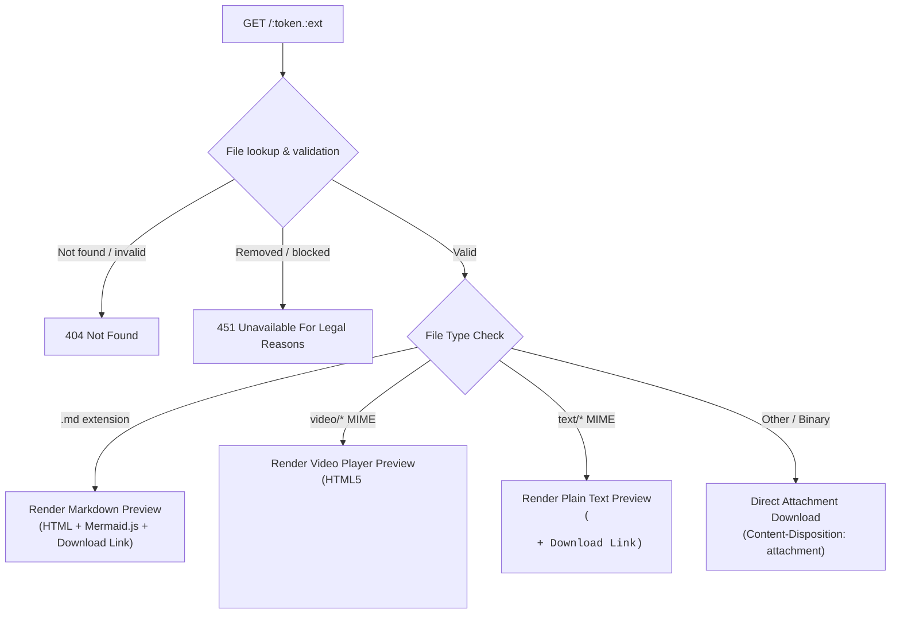

# 0x0-Dockerized API Documentation

This document provides the complete HTTP API reference for the 0x0-dockerized file hosting service.

---

## Overview

0x0-dockerized is a lightweight, hardened HTTP file hosting service. It provides:
- Direct file uploads via standard `multipart/form-data` POST requests.
- Unique, randomized, URL-safe 12-character tokens for hosted files.
- Smart browser previews for Markdown (`.md`), Videos (`video/*`), and Plain Text (`text/*`).
- Dedicated download endpoint preserving the original uploaded filename.
- Configurable sliding-scale file retention.

Base URL (Local Docker): `http://localhost:8081`  
Base URL (Production with TLS): `https://your-domain.example`

---

## Endpoints

### 1. Upload File

Upload a file directly to the service.

- **URL:** `/`
- **Method:** `POST`
- **Content-Type:** `multipart/form-data`
- **Form Field:** `file` (binary or text file payload)

#### Request Headers
| Header | Type | Description |
|---|---|---|
| `Content-Type` | `string` | Must be `multipart/form-data; boundary=...` |

#### Request Parameters
| Parameter | Location | Type | Required | Description |
|---|---|---|---|---|
| `file` | Form body | File | Yes | The file content to upload. |

#### Response
- **Status:** `200 OK`
- **Content-Type:** `text/html; charset=utf-8` (or plain URL string)
- **Body:** The public URL of the uploaded file followed by a newline (`\n`).

#### Examples

##### Using `curl`
```bash
curl -F'file=@document.pdf' https://your-domain.example/
```
**Response:**
```text
https://your-domain.example/DEQhd2uFteib.pdf
```

##### Using `curl` with custom filename
```bash
curl -F'file=@report.md;filename=project-overview.md' https://your-domain.example/
```
**Response:**
```text
https://your-domain.example/Pwq0SWBInTpA.md
```

##### Using Python (`requests`)
```python
import requests

with open("example.png", "rb") as f:
    response = requests.post("https://your-domain.example/", files={"file": f})

file_url = response.text.strip()
print(f"Uploaded to: {file_url}")
```

##### Using JavaScript (`fetch`)
```javascript
const formData = new FormData();
formData.append('file', fileBlob, 'video.mp4');

const response = await fetch('https://your-domain.example/', {
  method: 'POST',
  body: formData
});

const fileUrl = (await response.text()).trim();
console.log('Uploaded to:', fileUrl);
```

---

### 2. View / Preview File

Retrieve an uploaded file or render its browser preview page based on its MIME type and extension.

- **URL:** `/<token><extension>`
- **Method:** `GET`

#### URL Parameters
| Parameter | Type | Description |
|---|---|---|
| `token` | `string` | 12-character URL-safe random token (e.g., `DEQhd2uFteib`). |
| `extension` | `string` | File extension matching the uploaded file (e.g., `.md`, `.mp4`, `.png`, `.txt`). |

#### Behavior by File Type



1. **Markdown Preview (`.md` files)**:
   - Renders a clean, responsive HTML document.
   - Parses Markdown syntax (headings, lists, blockquotes, code blocks, tables).
   - Sanitizes HTML tags and attributes with `bleach` to prevent XSS attacks.
   - Client-side rendering for Mermaid diagrams in ` ```mermaid ` blocks.
   - Includes a top **Download** hyperlink pointing to `/download/<token><extension>`.
   - Sets `X-Content-Type-Options: nosniff`.

2. **Video Preview (`video/*` files)**:
   - Renders a standalone HTML page with a native `<video controls preload="metadata">` player.
   - Includes a top **Download** hyperlink pointing to `/download/<token><extension>`.
   - Streaming source points to `/download/<token><extension>` which supports HTTP Range requests (`206 Partial Content`).
   - Sets `X-Content-Type-Options: nosniff`.

3. **Plain Text Preview (`text/*` files without `.md`)**:
   - Renders HTML containing a top **Download** hyperlink and HTML-escaped text inside `<pre>` tags.
   - Sets `X-Content-Type-Options: nosniff`.

4. **Binary & Other Files (e.g. `.png`, `.pdf`, `.zip`, `.tar.gz`)**:
   - Returns the binary content with `Content-Disposition: attachment; filename="<original_filename>"`.
   - Sets `X-Content-Type-Options: nosniff`.

#### Example
```bash
curl -i https://your-domain.example/DEQhd2uFteib.png
```
**Response Headers:**
```http
HTTP/1.1 200 OK
Content-Type: image/png
Content-Disposition: attachment; filename="document.png"
Content-Length: 120485
X-Content-Type-Options: nosniff
```

---

### 3. Direct Download (Preserved Filename)

Explicitly download any file as an attachment, bypassing HTML preview pages, while preserving the original uploaded filename.

- **URL:** `/download/<token><extension>`
- **Method:** `GET`

#### URL Parameters
| Parameter | Type | Description |
|---|---|---|
| `token` | `string` | 12-character URL-safe random token. |
| `extension` | `string` | File extension matching the uploaded record. |

#### Response Headers
| Header | Value | Description |
|---|---|---|
| `Content-Type` | MIME type (e.g. `video/mp4`, `text/markdown; charset=utf-8`) | MIME type of stored content. |
| `Content-Disposition` | `attachment; filename="<original_filename>"` | Forces file download with original filename. |
| `X-Content-Type-Options` | `nosniff` | Prevents browser MIME sniffing. |
| `Accept-Ranges` | `bytes` | Supports byte-range seeking for media streams. |

#### Example
```bash
curl -OJ https://your-domain.example/download/Pwq0SWBInTpA.md
```
Saves the file directly as `project-overview.md`.

---

### 4. Service Landing Page

View service information, maximum upload size, retention formula, and blacklist rules in plain ASCII format.

- **URL:** `/`
- **Method:** `GET`
- **Response:** `200 OK` (ASCII documentation page)

---

### 5. Search Engine Exclusion

Prevents web crawlers and search indexers from indexing hosted files.

- **URL:** `/robots.txt`
- **Method:** `GET`
- **Response:**
  ```text
  User-agent: *
  Disallow: /
  ```

---

## HTTP Status & Error Codes

| Status Code | Description | Reason / Trigger |
|---|---|---|
| `200 OK` | Success | Upload succeeded or file retrieved. |
| `206 Partial Content` | Partial Content | Byte range request for media streaming. |
| `400 Bad Request` | Bad Request | POST request submitted without the `file` multipart field. |
| `404 Not Found` | Not Found | Token not found, extension mismatch, or file missing from disk. |
| `411 Length Required` | Length Required | Request submitted without a `Content-Length` header. |
| `413 Payload Too Large` | Payload Too Large | Upload exceeds `MAX_CONTENT_LENGTH`. |
| `414 URI Too Long` | URI Too Long | Request URL exceeds `MAX_URL_LENGTH` (4096 bytes). |
| `415 Unsupported Media Type` | Unsupported Media Type | Uploaded file matches `FHOST_MIME_BLACKLIST`. |
| `451 Unavailable For Legal Reasons` | Blocked Content | File marked as `removed` or client IP in `FHOST_UPLOAD_BLACKLIST`. |

---

## Security & Content Policies

### Blocked MIME Types (`FHOST_MIME_BLACKLIST`)
Active executable payloads and potentially dangerous web content are rejected immediately with HTTP 415:
- `application/xml`
- `application/xhtml+xml`
- `application/x-dosexec` (Windows/DOS executables)
- `application/java-archive` (`.jar`)
- `application/java-vm` (`.class`)
- `image/svg+xml` (SVG files with potential inline scripts)
- `text/html` (HTML files with potential inline scripts)

MIME type detection is performed on the raw bytes using `python-magic` (`libmagic`), preventing bypass through altered file extensions.

---

## Retention Policy

Files are retained based on file size according to a non-linear cubic decay curve:

$$\text{retention (days)} = 30 + (-365 + 30) \times \left(\frac{\text{file\_size}}{\text{MAX\_CONTENT\_LENGTH}} - 1\right)^3$$

- **Minimum Retention:** 30 days (for files at maximum upload size).
- **Mid-size Retention:** ~197.5 days (for files at 50% max size).
- **Maximum Retention:** 365 days (for very small files).

Expired files are removed by running the retention cleanup utility (`cleanup.py`).
