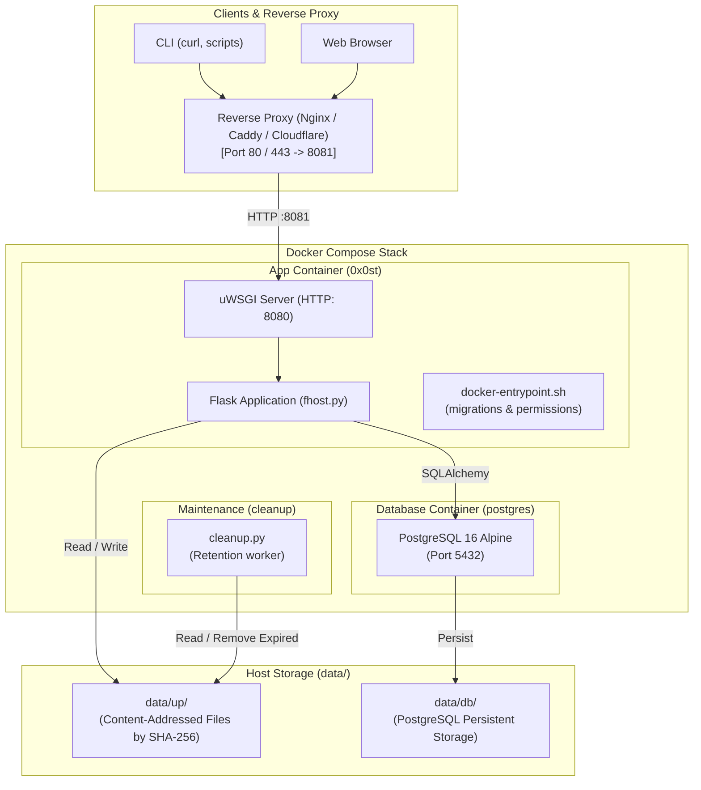
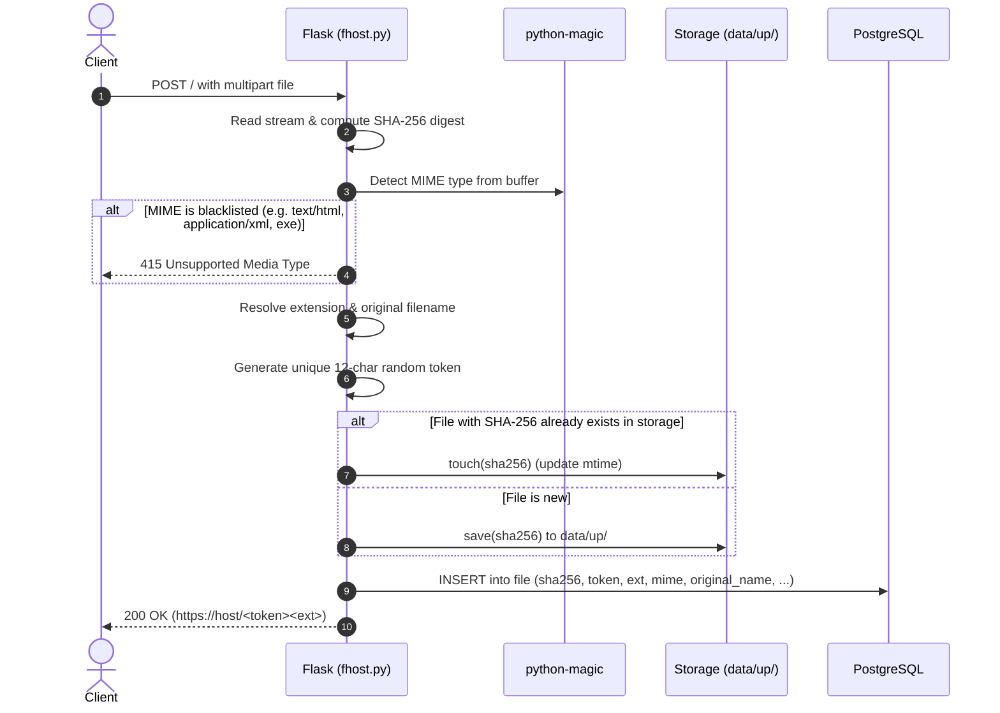

# 0x0-Dockerized Architecture Documentation

This document describes the architectural design, system boundaries, component interactions, and technical decisions of the `0x0-dockerized` project.

---

## 1. System Overview & Context

`0x0-dockerized` is a hardened, self-hosted file hosting service built on top of the `0x0` / The Null Pointer codebase. The repository wraps a Flask application in a robust Docker Compose environment.

### Primary Goals
1. **Direct File Hosting:** Enable fast, simple file uploads via `curl` and web clients.
2. **Predictable & Secure URLs:** Generate fixed-length, random, unguessable 12-character URL tokens.
3. **Rich Previews:** Provide instant browser previews for Markdown (`.md`), Video (`video/*`), and Plain Text (`text/*`) uploads without sacrificing downloadability.
4. **Filename Preservation:** Retain the original uploaded filename upon download.
5. **Security Hardening:** Reject executable/active web payloads, disable unsafe proxy/shortener features, and strictly enforce security headers.
6. **Zero-Overhead Storage:** Deduplicate stored payloads on disk by SHA-256 digest while keeping separate metadata records for each upload.

---

## 2. High-Level Architecture

The system consists of two primary runtime services and an on-demand maintenance task managed via Docker Compose:



---

## 3. Core Subsystems & Workflows

### 3.1 Upload Flow

When a client performs a `POST /` request with multipart file data:



### 3.2 Retrieval & Preview Routing

When a client accesses `GET /<token><ext>` or `GET /download/<token><ext>`:

```mermaid
sequenceDiagram
    autonumber
    actor Browser
    participant Flask as Flask (fhost.py)
    participant DB as PostgreSQL
    participant FS as Storage (data/up/)

    Browser->>Flask: GET /<token><ext>
    Flask->>DB: Query File by token & extension
    alt Token not found or removed
        Flask-->>Browser: 404 Not Found / 451 Removed
    end
    Flask->>FS: Verify data/up/<sha256> exists
    alt Target is .md file
        Flask->>Flask: Parse Markdown, sanitize with Bleach, inject Mermaid wrappers
        Flask-->>Browser: 200 OK (Render markdown_preview.html)
    else Target is video/* MIME
        Flask-->>Browser: 200 OK (Render video_preview.html with HTML5 player)
        Browser->>Flask: GET /download/<token><ext> (video stream)
        Flask->>FS: Stream range bytes (206 Partial Content)
    else Target is text/* MIME
        Flask-->>Browser: 200 OK (Render preview.html <pre>)
    else Target is binary or /download/ requested
        Flask->>FS: Send file with Content-Disposition: attachment; filename="..."
        Flask-->>Browser: 200 OK (Attachment download)
    end
```

---

## 4. Database Schema & Migration Architecture

Database state is tracked through Alembic / Flask-Migrate in `0x0/migrations/`.

```mermaid
erDiagram
    FILE {
        int id PK
        string sha256
        string token UK "12 chars, URL-safe"
        text ext "e.g. .mp4, .md, .tar.gz"
        text mime "e.g. video/mp4, text/markdown"
        text addr "Uploader IP address"
        boolean removed "Soft delete flag"
        float nsfw_score "NSFW classification score"
        text original_name "Preserved uploaded filename"
    }

    URL {
        int id PK
        text url UK "URL string (legacy/unused in hardened mode)"
    }
```



### Key Schema Evolutions
1. **Random Token Migration (`0d5b8c4b9f0d`)**: Introduced 12-character random tokens using a 64-character URL-safe alphabet (`[A-Za-z0-9_-]`), replacing sequential integer IDs.
2. **Filename Preservation Migration (`a1b2c3d4e5f6`)**: Added `original_name` column and altered table structure to allow multiple distinct upload tokens to point to the same deduplicated `sha256` payload.

---

## 5. Security Architecture

### 5.1 Defense in Depth Strategy
1. **Strict MIME Sniffing:** MIME types are detected directly from file byte content using `python-magic` (`libmagic`), ignoring user-supplied HTTP `Content-Type` headers if fraudulent.
2. **Active Web Payload Blacklist:** Rejection of HTML, XML, SVG, Java bytecode, and Windows binaries mitigates XSS, CSRF, and drive-by malware distribution.
3. **HTML Sanitization:** Markdown rendering uses `bleach` to whitelist safe HTML tags (`<p>`, `<h1>`-`<h6>`, `<code>`, `<pre>`, `<table>`, `<a>`, ``, etc.) and strip unsafe tags/scripts.
4. **Security Headers:** Every response is delivered with `X-Content-Type-Options: nosniff`. Downloads are served as attachments (`Content-Disposition: attachment`).
5. **Attack Surface Reduction:**
   - Remote URL fetching (`url=` parameter) is completely disabled to eliminate Server-Side Request Forgery (SSRF).
   - Generic URL shortening is disabled.
6. **Container Isolation:** The uWSGI server executes as an unprivileged user (`app`, UID/GID 1000). The database port (`5432`) is internal to the Docker network.

---

## 6. Key Design Decisions and Trade-offs

| Decision | Approach Chosen | Rationale | Alternatives Considered |
|---|---|---|---|
| **Video Preview** | Native HTML5 `<video>` player pointing at `/download/` route | Zero external JS dependencies, lightweight, supports HTTP Range seeking out-of-the-box in Flask 3.1. | Video.js or CDN player (rejected: external dependency and heavier footprint). |
| **Markdown & Diagram Preview** | Server-side Python-Markdown + Bleach, client-side Mermaid.js 10.9.1 | Fast initial HTML render, strict security sanitization, diagrams rendered seamlessly on demand. | Full client-side markdown parsing or server-side puppeteer diagram rendering (heavy). |
| **Token Generation** | 12-character random token from 64-char alphabet (~$4.7 \times 10^{21}$ combinations) | Collision-resistant, URL-safe, unguessable, human-friendly length. | UUIDv4 (longer/uglier), sequential IDs (predictable / harvestable). |
| **Deduplication vs Metadata** | Hash-based file storage (`data/up/<sha256>`) with independent DB records | Minimizes disk usage when same file is uploaded multiple times, while preserving individual upload tokens and custom filenames. | Duplicate files on disk (wastes storage) or single DB record per hash (loses individual filenames/tokens). |
| **Web Server Layer** | uWSGI HTTP socket mapped to host port `8081` | Simple standalone container stack, ready to sit behind any external TLS reverse proxy (Nginx, Caddy, Cloudflare, Traefik). | Built-in Nginx container in Compose (added configuration overhead when users already have a host reverse proxy). |
