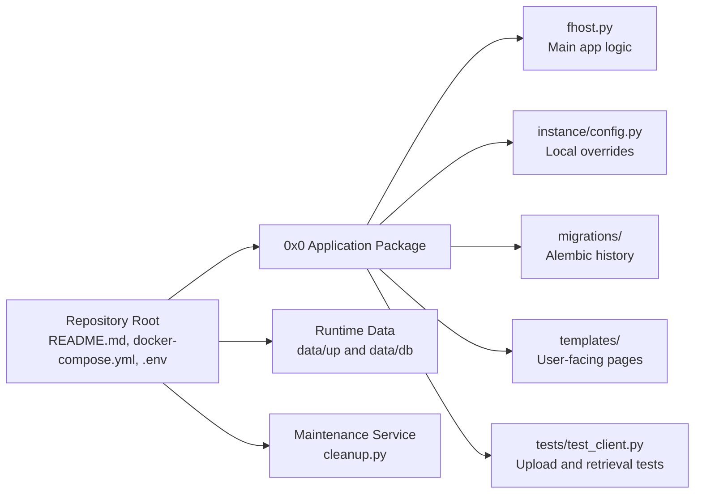

# 0x0-Dockerized Master Technical Specification (MTS)
Version: v0.1  
Status: Draft  
Source Baseline: `AGENTS.md` Repository Guidelines  
Format: Markdown-first working specification

---

## 1. Purpose

This Master Technical Specification defines the shared technical baseline for the 0x0-dockerized repository. It translates the repository guidance in `AGENTS.md` into an implementation-oriented architecture that can guide deployment work, application changes, testing, maintenance operations, and future technical refinement.

This document is intended to:
- establish the target system boundary
- define the current repository and application architecture
- define responsibilities across the repository root and application modules
- define platform-wide technical conventions for build, test, change control, and security
- identify implementation sequencing and technical risks

This document does not replace the application source code, Docker configuration, migration history, or tests. Detailed endpoint logic, schema definitions, runtime values, and compose service internals remain governed by the implementation artifacts themselves.

---

## 2. Product Context

The repository is a deployment wrapper around a Flask-based file hosting application. The repository root contains operational and deployment assets, while the actual Flask application lives in `0x0/`. The supported scope is intentionally narrow: direct uploads and retrieval only, with retention cleanup handled through a separate maintenance path.

### 2.1 System Boundary

**In scope**
- root-level deployment wrapper and operations documentation
- Docker Compose stack definition for application, database, and maintenance services
- Flask application logic under `0x0/`
- retention cleanup via `cleanup.py`
- local configuration overrides via `instance/config.py`
- database evolution through Alembic migrations
- server-rendered pages in `templates/`
- automated validation in `tests/test_client.py`
- upload and retrieval behavior

**Out of scope**
- remote URL import
- generic URL shortening
- unsafe MIME types unless explicitly justified and tested
- committing `.env`, secrets, or runtime data under `data/`
- undocumented platform expansion beyond the hardened upload/retrieval scope

### 2.2 Legacy Context

The available source guidance does not describe a formal legacy platform being replaced. The only explicit structural distinction is between the repository root as deployment wrapper and `0x0/` as the actual Flask application.

---

## 3. Target Architecture Summary

The target architecture is a Docker-oriented repository with a root-level deployment wrapper, a nested Flask application, a maintenance path for cleanup, filesystem-backed runtime data, relational persistence managed through migrations, and a pytest-based validation layer focused on upload and retrieval behavior. Within the upload path, randomized public links remain the external identifier while the original uploaded filename is preserved per upload for download responses.

### 3.1 Architectural Style

- repository-root deployment wrapper for operations and environment bootstrap
- nested Flask web application under `0x0/`
- single main application logic entrypoint in `fhost.py`
- separate retention and cleanup logic in `cleanup.py`
- local configuration overrides through `instance/config.py`
- schema evolution through Alembic migrations
- server-rendered user-facing pages through `templates/`
- pytest-based validation of HTTP behavior through `tests/test_client.py`

### 3.2 Development and Runtime Position

The repository supports two operating modes:
- full-stack checks using Docker Compose from the repository root
- local application development inside `0x0/` using a Python virtual environment, Flask migration commands, and pytest

This is a shared implementation baseline rather than separate prototype and production architectures. The source guidance emphasizes operational repeatability, minimal structural drift, and hardening of the current scope.

### 3.3 Proposed Technical Stack Position

| Layer | Baseline Decision |
|---|---|
| Application framework | Flask application under `0x0/` |
| Language | Python |
| Deployment orchestration | Docker Compose |
| Database | Relational database with Alembic migration history |
| Configuration | `.env` plus local overrides in `instance/config.py` |
| Frontend approach | Server-rendered pages from `templates/` |
| Testing | Pytest |
| Runtime storage | `data/up/` and `data/db/`, kept untracked |
| Maintenance | Separate cleanup path via `cleanup.py` |
| Security posture | Hardened for direct uploads and retrieval only |

### 3.4 High-Level Module Topology

---

## 4. Architectural Principles

1. **Repository root as deployment wrapper**  
   Operational assets belong at the root, while application code belongs in `0x0/`.

2. **Keep changes narrow and structure-aware**  
   Changes should remain consistent with the current single-file application structure unless a refactor is necessary.

3. **Runtime data and secrets are non-source assets**  
   `.env`, secrets, and anything under `data/` must remain untracked.

4. **Validation is mandatory for behavior changes**  
   Upload validation, URL generation, and response-header changes should be covered by deterministic pytest assertions and, where relevant, curl-based verification.

5. **Match surrounding code style rather than imposing new tooling**  
   No formatter or linter is defined; contributors should follow the existing Python conventions and local code patterns.

6. **Hardening defaults should not be weakened casually**  
   Remote URL import, generic URL shortening, and unsafe MIME-type support remain disabled unless explicitly justified and tested.

---

## 5. Module Architecture

## 5.1 Repository Root Deployment Wrapper

**Role**  
Provides the operational wrapper for the full stack.

**Sub-modules**
- `README.md`
- `docker-compose.yml`
- `.env` bootstrap from `.env.example`
- `data/up/`
- `data/db/`

**Primary responsibilities**
- document operational procedures
- define the app, database, and maintenance services
- support full-stack build and startup from the repository root
- host runtime upload and database storage paths
- keep operational state outside version control

**Technical notes**
- this layer is the deployment wrapper, not the main app implementation
- runtime data must stay untracked
- Docker-based checks should start here

## 5.2 Flask Application Core (`0x0/fhost.py`)

**Role**  
Implements the main Flask application behavior.

**Sub-modules**
- request handling and core app logic in `fhost.py`
- upload behavior
- retrieval behavior
- randomized URL generation behavior
- response-header behavior, including filename-preserving download responses

**Primary responsibilities**
- serve the application’s main upload and retrieval workflows
- preserve the current single-file application structure unless refactoring is necessary
- generate randomized token-based public links for uploaded files
- preserve the uploaded filename as per-upload metadata for download responses
- align behavior changes with tests
- support local development commands within `0x0/`

**Technical notes**
- this is the main application entrypoint named in the repository guidance
- model names are expected to remain concise, such as `File` and `URL`
- upload records may share the same stored file content hash while remaining distinct links when filename-preservation behavior requires per-upload metadata
- surrounding code style should be matched carefully

## 5.3 Retention Cleanup Module (`0x0/cleanup.py`)

**Role**  
Handles retention cleanup and maintenance-oriented behavior.

**Sub-modules**
- `cleanup.py`
- maintenance profile execution through Docker Compose

**Primary responsibilities**
- perform cleanup operations tied to retention behavior
- remain operationally callable through the maintenance profile
- separate maintenance concerns from the main request-serving path

**Technical notes**
- cleanup is a distinct concern from the main app logic
- maintenance execution may be run independently from the app service

## 5.4 Configuration and Schema Layer (`0x0/instance/config.py`, `0x0/migrations/`)

**Role**  
Provides local configuration control and database schema evolution support.

**Sub-modules**
- `instance/config.py`
- `migrations/`

**Primary responsibilities**
- hold local configuration overrides
- support database upgrades via Flask and Alembic tooling
- preserve schema history in versioned migration files
- keep runtime state separate from migration artifacts

**Technical notes**
- configuration is environment-specific
- migration history is authoritative for schema evolution
- concrete schema internals are outside the scope of this document unless confirmed from code

## 5.5 Presentation and Verification Layer (`0x0/templates/`, `0x0/tests/test_client.py`)

**Role**  
Provides user-facing rendering and automated verification.

**Sub-modules**
- `templates/`
- `tests/test_client.py`
- adjacent `test_*.py` files where later added

**Primary responsibilities**
- render user-facing pages
- validate upload and retrieval behavior
- verify randomized URL generation and response headers
- verify preserved original filenames on download responses
- prefer deterministic assertions such as token regex and HTTP status checks

**Technical notes**
- pytest should be run from `0x0/` so imports and relative paths resolve correctly
- UI or HTTP changes should be accompanied by curl output or screenshots when submitted in pull requests

---

## 6. Cross-Module Interaction Model

| Interaction | Direction | Technical Intent |
|---|---|---|
| Repository root -> application core | runtime dependency | build, run, and verify the application stack |
| Repository root -> cleanup module | maintenance dependency | run retention cleanup via maintenance profile |
| Application core -> config layer | configuration dependency | apply local overrides |
| Application core -> migrations | schema dependency | apply database upgrade history |
| Application core -> templates | rendering dependency | serve user-facing pages |
| Application core -> runtime data | persistence dependency | store upload and database runtime state |
| Tests -> application core | verification dependency | validate upload, retrieval, randomized URL, and header behavior |

### 6.1 Interaction Rules

- use Docker Compose from the repository root for full-stack checks
- use a local virtualenv inside `0x0/` for focused application development
- run `FLASK_APP=fhost flask db upgrade` before local validation where schema changes matter
- run pytest from `0x0/`
- do not treat runtime data directories as source-controlled modules

---

## 7. Security and Access Control

### 7.1 Security Model

The current security posture is repository- and feature-oriented rather than role-matrix-oriented.

Baseline requirements:
- do not commit `.env`
- do not commit secrets
- do not commit anything under `data/`
- keep the fork limited to direct uploads and retrieval only
- keep remote URL import disabled unless explicitly justified and tested
- keep generic URL shortening disabled unless explicitly justified and tested
- keep unsafe MIME types disabled unless explicitly justified and tested

### 7.2 Access Control Guidance

The available source guidance does not define an end-user RBAC model. This document therefore limits itself to repository and implementation governance:
- operational access is exercised through deployment and development workflows
- code changes are controlled through commits and pull requests
- application-level permissions should not be invented here without confirming them from actual source code

### 7.3 Change Traceability Requirements

Traceability expectations include:
- concise, imperative commit messages
- optional prefixes such as `feat:`, `chore:`, `docs:`, and `test:` where helpful
- pull requests that explain deployment or app impact
- explicit note of config or migration changes
- links to related issues
- curl output or screenshots when UI or HTTP behavior changes

---

## 8. Data Architecture

### 8.1 Data Ownership Pattern

The repository distinguishes clearly between versioned source artifacts and runtime data:

| Area | Ownership Pattern |
|---|---|
| `0x0/` source files | version-controlled application code |
| `0x0/migrations/` | version-controlled schema history |
| `0x0/instance/config.py` | local configuration override source |
| `data/up/` | runtime upload storage, untracked |
| `data/db/` | runtime database storage, untracked |

### 8.2 Entity Design Guidance

The current application implementation confirms the following safe design guidance:
- keep model names concise
- preserve the current structural simplicity unless refactoring is necessary
- align behavior changes with deterministic tests
- treat migration history as the authoritative path for schema change
- keep randomized link identity separate from preserved download filename metadata
- allow multiple upload records to reference the same stored file content when per-upload filename preservation is required

### 8.3 Shared Technical Data Structures

The source guidance confirms the presence of:
- upload runtime storage under `data/up/`
- database runtime storage under `data/db/`
- Alembic schema history under `migrations/`
- per-upload file metadata that includes a randomized token and an optional preserved original filename for download responses

Beyond that, concrete tables and relationships should be derived from code and migrations, not assumed here.

### 8.4 Reporting Read Models

No separate reporting, analytics, or aggregate read-model architecture is defined in the available source guidance. Verification is centered on functional behavior rather than business reporting.

---

## 9. Attachment and Document Handling

Direct file upload and retrieval are core to the repository’s intended scope.

### 9.1 Attachment Rules

- uploaded content is runtime data and must remain outside version control
- each successful upload should retain a randomized public link
- each successful upload should preserve the uploaded filename for download behavior, even when stored content is deduplicated by hash
- upload validation must be tested when behavior changes
- retrieval behavior must be tested when response handling changes
- URL generation behavior must be verified when link logic changes
- unsafe MIME-type support must remain disabled unless explicitly justified and tested

### 9.2 Technical Reference Material

The available guidance does not define a document taxonomy, attachment metadata model, or retention classification scheme beyond the presence of upload runtime storage and cleanup behavior.

---

## 10. Workflow and Status Design Conventions

### 10.1 Development Workflow Model

The standard technical workflow implied by the source guidance is:
- bootstrap environment from `.env.example`
- build and start the stack with Docker Compose
- run cleanup through the maintenance profile when needed
- verify upload behavior with curl
- verify download headers when URL or filename behavior changes
- for local development, create a virtualenv, install dev requirements, run DB upgrade, and execute pytest from `0x0/`

### 10.2 Review and Approval Design

Formal business approval states are not defined. The effective repository-level review model is:
- contributors prepare narrow, style-consistent changes
- tests are run before submission
- pull requests explain technical impact and notable config or migration changes
- evidence is attached for UI or HTTP behavior changes

### 10.3 Notifications

No application notification subsystem is defined in the available guidance. Current feedback mechanisms are operational:
- pytest results
- curl output
- screenshots
- pull request commentary

---

## 11. Integration Architecture

### 11.1 Initial Position

The baseline architecture is standalone and local to the repository’s defined stack. The available guidance describes application, database, and maintenance services under Docker Compose but does not define external integrations.

### 11.2 Integration Design Rules

If future integration is introduced, it should:
- preserve the hardened direct-upload/retrieval scope unless a change is explicitly approved
- avoid exposing secrets in source control
- include explicit testing for new behavior
- document deployment and operational impact clearly

### 11.3 Known Open Integration Topic

The primary open integration question is whether the repository should ever expand beyond direct uploads and retrieval into broader import or URL-service behavior. Current guidance treats that as exceptional, not default.

---

## 12. Reporting Architecture

### 12.1 Reporting Principles

The repository currently favors technical verification evidence over formal reporting. Preferred evidence includes:
- deterministic pytest assertions
- curl-based checks
- screenshots when user-facing behavior changes materially

### 12.2 Reporting Sources

Current reporting and validation sources are expected to include:
- pytest output
- curl output
- pull request descriptions
- screenshots for UI or HTTP changes

---

## 13. Non-Functional Requirements

### 13.1 Maintainability

- use 4-space indentation
- use `UPPER_SNAKE_CASE` for module-level constants
- use `snake_case` for functions and variables
- keep comments minimal and useful
- match the surrounding code carefully
- avoid unnecessary structural expansion

### 13.2 Performance

The available source guidance does not define formal throughput or latency targets. The practical baseline is to preserve correct upload and retrieval behavior, avoid regressions in randomized URL handling, preserved download filenames, and response headers, and keep test coverage aligned with those behaviors.

### 13.3 Reliability

- support repeatable full-stack startup via Docker Compose
- support repeatable local setup via virtualenv and development requirements
- keep migration execution explicit through Flask DB upgrade commands
- run deterministic pytest checks before submission
- preserve cleanup execution as a defined maintenance path

### 13.4 Observability

- use pytest as the primary automated behavior signal
- use curl for direct HTTP verification
- document config and migration changes clearly in pull requests
- include screenshots when UI or HTTP presentation changes warrant them

---

## 14. Delivery Model and Implementation Sequencing

### 14.1 Recommended Build Order

1. **Environment bootstrap**
   - copy `.env.example` to `.env`
   - confirm root-level deployment assets

2. **Full-stack bring-up**
   - run `docker compose up -d --build`
   - confirm application, database, and maintenance service readiness

3. **Maintenance path validation**
   - run `docker compose --profile maintenance run --rm cleanup`

4. **Application-level validation**
   - run upload verification with curl from the repository root

5. **Local development validation**
   - create and activate a Python virtualenv inside `0x0/`
   - install development dependencies
   - run `FLASK_APP=fhost flask db upgrade`
   - run `python -m pytest -q`

### 14.2 Demo Operation Assumption

The practical demo and validation mode for this repository is technical rather than presentation-driven:
- the stack can be exercised end-to-end from Docker Compose
- upload behavior can be demonstrated with curl
- behavior correctness can be shown through pytest

### 14.3 Module Dependency Guidance

Detailed follow-on implementation notes should be organized around the real repository areas:
- repository root deployment wrapper
- application core in `fhost.py`
- cleanup module
- configuration and schema layer
- presentation and verification layer

---

## 15. Risks and Open Decisions

| Topic | Risk | Next Handling Step |
|---|---|---|
| Single-file app concentration | continued growth in `fhost.py` may reduce maintainability | define refactor thresholds before major expansion |
| Unverified schema internals | migration presence is known, but detailed schema is not specified here | derive concrete data structures from migration files before deeper design work |
| Hardening drift | enabling remote import, URL shortening, or unsafe MIME support could weaken the intended posture | require explicit decision and tests |
| Secret or runtime leakage | accidental commit of `.env` or `data/` contents would violate the baseline | reinforce repo hygiene and review checks |
| Missing formal access model | application-level auth behavior is not described in the available guidance | inspect actual application source before documenting access rules |
| Compose and config assumptions | root assets are named, but internal service details are not confirmed here | inspect actual repository files before expanding operational detail |

---

## 16. Expected Downstream Artifacts

This MTS should drive the following downstream artifacts:
- a deployment runbook aligned with `README.md` and `docker-compose.yml`
- a code-grounded architecture note for `fhost.py`
- a schema inventory derived from `migrations/`
- a maintenance runbook for cleanup behavior
- a validation checklist covering upload handling, retrieval behavior, randomized URL generation, preserved download filenames, and response headers
- a hardening checklist covering secrets, runtime data, and restricted feature scope

---

## 17. Stop Rule for This Document

This MTS remains a repository-level technical baseline. It should not be expanded with invented endpoint contracts, unverified schema tables, or assumed permission models. Those details should only be added after direct inspection of the actual repository files.
